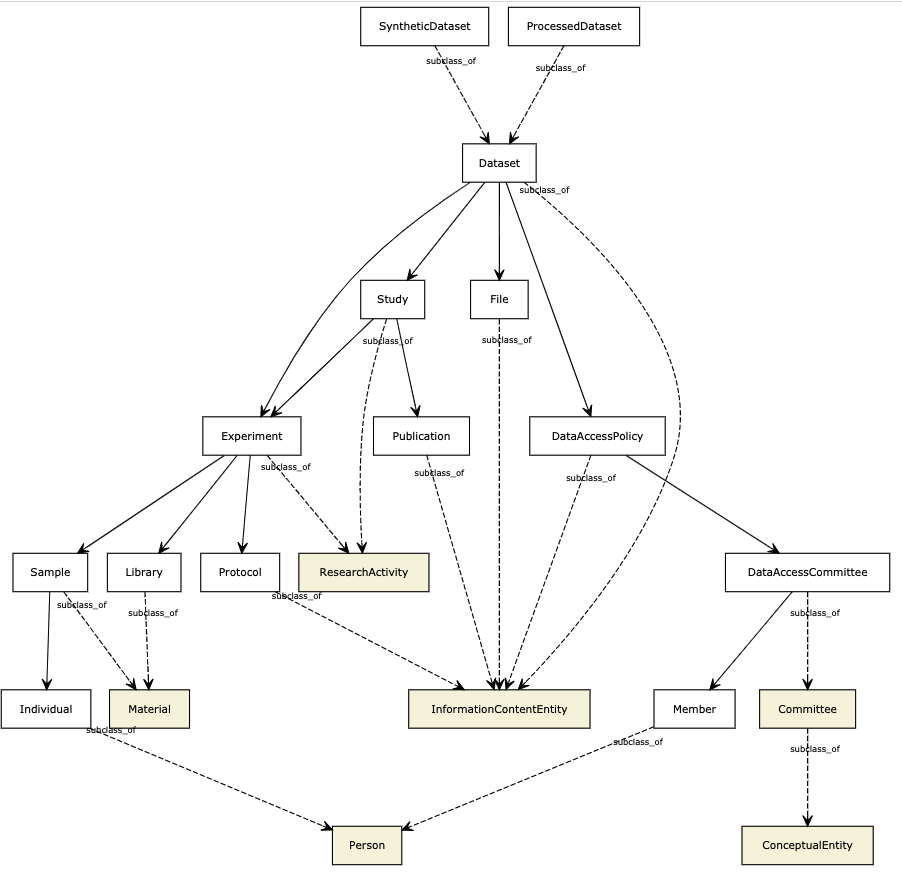

# GHGA Metadata Schema

This repository aims to serve as the source of truth for the metadata schema used by
the [German Human Genome-Phenome Archive](https://ghga.dkfz.de/).

The schema is modeled using [LinkML](https://github.com/linkml/linkml/) and exists
as a YAML, which can be found in [src/schema/](src/schema/ghga.yaml).

Using the YAML and the LinkML framework, we autogenerate vendor/technology specific
artifacts like:

- [JSON Schema](jsonschema/ghga.schema.json)
   - JSON Schema definitions of all classes and properties
- [Python Dataclasses](python/ghga.py)
   - Python Dataclasses for each defined class
- [GraphQL](graphql/ghga.graphql)
   - GraphQL types for each defined class
- [ShEx](shex/ghga.shex)
   - Shape Expressions for each defined class
- [RDF](rdf/ghga.ttl)
   - The model represented as RDF Turtle (TTL)
- [OWL](owl/ghga.owl.ttl)
   - The model in Web Ontology Language (OWL), serialized as RDF Turtle (TTL)
- [CSV](csv/ghga.csv)
  - A CSV summary of the model and its classes

Artifacts that are currently a work in progress:
- Protobuf
- SQL DDL
- Pydantic classes

## GHGA Metadata Schema Overview

