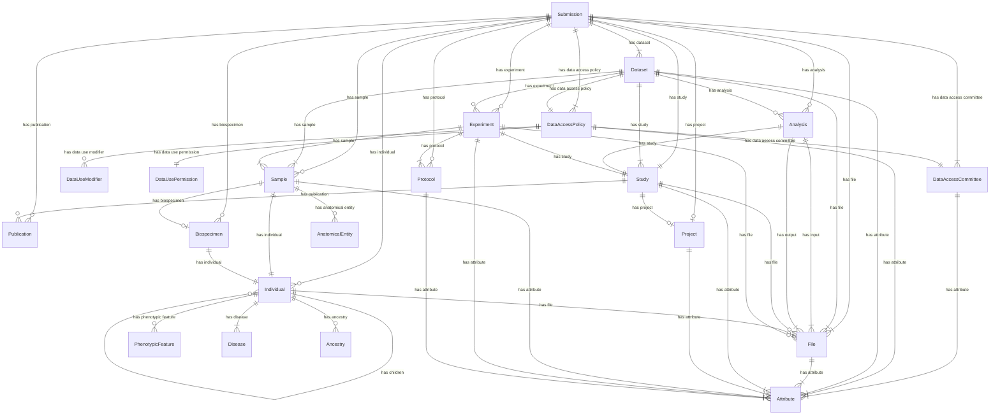
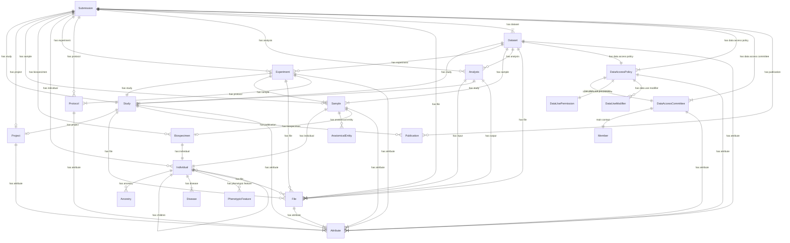

# Entity Relationship Diagrams

## GHGA-Base-Metadata-Schema

### Basic Diagram:

```mermaid
erDiagram
NamedThing {

}
Person {

}
Committee {

}
MaterialEntity {

}
BiologicalQuality {

}
InformationContentEntity {

}
PlannedProcess {

}
Investigation {

}
DataTransformation {

}
ResearchActivity {

}
Protocol {

}
Population {

}
DiseaseOrPhenotypicFeature {

}
OntologyClassMixin {

}
Attribute {

}
MetadataMixin {

}
AccessionMixin {

}
EgaAccessionMixin {

}
AttributeMixin {

}
DeprecatedMixin {

}
ReleaseStatusMixin {

}

Protocol ||--}| Attribute : "has attribute"
AttributeMixin ||--}| Attribute : "has attribute"
DeprecatedMixin ||--|| NamedThing : "replaced by"

```

## GHGA-Submission-Metadata-Schema

### Basic Diagram:

```mermaid
erDiagram
Submission {

}
Publication {

}
DataAccessCommittee {

}
Attribute {

}
DataAccessPolicy {

}
DataUseModifier {

}
DataUsePermission {

}
Dataset {

}
File {

}
Analysis {

}
Study {

}
Project {

}
Sample {

}
Biospecimen {

}
Individual {

}
PhenotypicFeature {

}
Disease {

}
Ancestry {

}
AnatomicalEntity {

}
Experiment {

}
Protocol {

}

Submission ||--|| Study : "has study"
Submission ||--|o Project : "has project"
Submission ||--}o Sample : "has sample"
Submission ||--}o Biospecimen : "has biospecimen"
Submission ||--}o Individual : "has individual"
Submission ||--}o Experiment : "has experiment"
Submission ||--}o Protocol : "has protocol"
Submission ||--}o Analysis : "has analysis"
Submission ||--}| File : "has file"
Submission ||--}| Dataset : "has dataset"
Submission ||--}| DataAccessPolicy : "has data access policy"
Submission ||--}| DataAccessCommittee : "has data access committee"
Submission ||--}o Publication : "has publication"
DataAccessCommittee ||--}| Attribute : "has attribute"
DataAccessPolicy ||--|| DataAccessCommittee : "has data access committee"
DataAccessPolicy ||--|| DataUsePermission : "has data use permission"
DataAccessPolicy ||--}o DataUseModifier : "has data use modifier"
DataAccessPolicy ||--}| Attribute : "has attribute"
Dataset ||--}| Study : "has study"
Dataset ||--}o Experiment : "has experiment"
Dataset ||--}| Sample : "has sample"
Dataset ||--}o Analysis : "has analysis"
Dataset ||--}| File : "has file"
Dataset ||--|| DataAccessPolicy : "has data access policy"
Dataset ||--}| Attribute : "has attribute"
File ||--}| Attribute : "has attribute"
Analysis ||--}| File : "has input"
Analysis ||--|| Study : "has study"
Analysis ||--}| File : "has output"
Study ||--|o Project : "has project"
Study ||--}o File : "has file"
Study ||--}o Publication : "has publication"
Study ||--}| Attribute : "has attribute"
Project ||--}| Attribute : "has attribute"
Sample ||--|| Individual : "has individual"
Sample ||--}o AnatomicalEntity : "has anatomical entity"
Sample ||--|o Biospecimen : "has biospecimen"
Sample ||--}| Attribute : "has attribute"
Biospecimen ||--|| Individual : "has individual"
Individual ||--}o Ancestry : "has ancestry"
Individual ||--}o Individual : "has parent"
Individual ||--}o Individual : "has children"
Individual ||--}| Disease : "has disease"
Individual ||--}o PhenotypicFeature : "has phenotypic feature"
Individual ||--}o File : "has file"
Experiment ||--|| Study : "has study"
Experiment ||--}| Sample : "has sample"
Experiment ||--}o File : "has file"
Experiment ||--}| Protocol : "has protocol"
Experiment ||--}| Attribute : "has attribute"
Protocol ||--}| Attribute : "has attribute"

```

## GHGA-Advance-Metadata-Schema

### Basic Diagram:

```mermaid
erDiagram
Submission {

}
Publication {

}
DataAccessCommittee {

}
Attribute {

}
Member {

}
DataAccessPolicy {

}
DataUseModifier {

}
DataUsePermission {

}
Dataset {

}
File {

}
Analysis {

}
Study {

}
Project {

}
Sample {

}
Biospecimen {

}
Individual {

}
PhenotypicFeature {

}
Disease {

}
Ancestry {

}
AnatomicalEntity {

}
Experiment {

}
Protocol {

}

Submission ||--|| Study : "has study"
Submission ||--|o Project : "has project"
Submission ||--}o Sample : "has sample"
Submission ||--}o Biospecimen : "has biospecimen"
Submission ||--}o Individual : "has individual"
Submission ||--}o Experiment : "has experiment"
Submission ||--}o Protocol : "has protocol"
Submission ||--}o Analysis : "has analysis"
Submission ||--}| File : "has file"
Submission ||--}| Dataset : "has dataset"
Submission ||--}| DataAccessPolicy : "has data access policy"
Submission ||--}| DataAccessCommittee : "has data access committee"
Submission ||--}o Publication : "has publication"
DataAccessCommittee ||--|| Member : "main contact"
DataAccessCommittee ||--}| Attribute : "has attribute"
DataAccessPolicy ||--|| DataAccessCommittee : "has data access committee"
DataAccessPolicy ||--|| DataUsePermission : "has data use permission"
DataAccessPolicy ||--}o DataUseModifier : "has data use modifier"
DataAccessPolicy ||--}| Attribute : "has attribute"
Dataset ||--}| Study : "has study"
Dataset ||--}o Experiment : "has experiment"
Dataset ||--}| Sample : "has sample"
Dataset ||--}o Analysis : "has analysis"
Dataset ||--}| File : "has file"
Dataset ||--|| DataAccessPolicy : "has data access policy"
Dataset ||--}| Attribute : "has attribute"
File ||--}| Attribute : "has attribute"
Analysis ||--}| File : "has input"
Analysis ||--|| Study : "has study"
Analysis ||--}| File : "has output"
Study ||--|o Project : "has project"
Study ||--}o File : "has file"
Study ||--}o Publication : "has publication"
Study ||--}| Attribute : "has attribute"
Project ||--}| Attribute : "has attribute"
Sample ||--|| Individual : "has individual"
Sample ||--}o AnatomicalEntity : "has anatomical entity"
Sample ||--|o Biospecimen : "has biospecimen"
Sample ||--}| Attribute : "has attribute"
Biospecimen ||--|| Individual : "has individual"
Individual ||--}o Ancestry : "has ancestry"
Individual ||--}o Individual : "has parent"
Individual ||--}o Individual : "has children"
Individual ||--}| Disease : "has disease"
Individual ||--}o PhenotypicFeature : "has phenotypic feature"
Individual ||--}o File : "has file"
Experiment ||--|| Study : "has study"
Experiment ||--}| Sample : "has sample"
Experiment ||--}o File : "has file"
Experiment ||--}| Protocol : "has protocol"
Experiment ||--}| Attribute : "has attribute"
Protocol ||--}| Attribute : "has attribute"

```

