# Entity Relationship Diagrams

## GHGA-Base-Metadata-Schema

An entity relationship diagram for the model found at: /workspace/src/schema/base_schema.yaml.  

```mermaid
erDiagram
NamedThing {
    string id  
    string alias  
    stringList xref  
    string creation_date  
    string update_date  
    string schema_type  
    string schema_version  
}
Person {
    string given_name  
    string family_name  
    string additional_name  
    string id  
    string alias  
    stringList xref  
    string creation_date  
    string update_date  
    string schema_type  
    string schema_version  
}
Committee {
    string name  
    string id  
    string alias  
    stringList xref  
    string creation_date  
    string update_date  
    string schema_type  
    string schema_version  
}
MaterialEntity {
    string id  
    string alias  
    stringList xref  
    string creation_date  
    string update_date  
    string schema_type  
    string schema_version  
}
BiologicalQuality {
    string id  
    string alias  
    stringList xref  
    string creation_date  
    string update_date  
    string schema_type  
    string schema_version  
}
InformationContentEntity {
    string id  
    string alias  
    stringList xref  
    string creation_date  
    string update_date  
    string schema_type  
    string schema_version  
}
PlannedProcess {
    string id  
    string alias  
    stringList xref  
    string creation_date  
    string update_date  
    string schema_type  
    string schema_version  
}
Investigation {
    string title  
    string description  
    string id  
    string alias  
    stringList xref  
    string creation_date  
    string update_date  
    string schema_type  
    string schema_version  
}
DataTransformation {
    string title  
    string description  
    string id  
    string alias  
    stringList xref  
    string creation_date  
    string update_date  
    string schema_type  
    string schema_version  
}
ResearchActivity {
    string title  
    string description  
    string id  
    string alias  
    stringList xref  
    string creation_date  
    string update_date  
    string schema_type  
    string schema_version  
}
Protocol {
    string name  
    string type  
    string description  
    string url  
    string id  
    string alias  
    stringList xref  
    string creation_date  
    string update_date  
    string schema_type  
    string schema_version  
}
Population {
    string name  
    string id  
    string alias  
    stringList xref  
    string creation_date  
    string update_date  
    string schema_type  
    string schema_version  
}
DiseaseOrPhenotypicFeature {
    string id  
    string concept_identifier  
    string concept_name  
    string description  
    string ontology_name  
    string ontology_version  
    string alias  
    stringList xref  
    string creation_date  
    string update_date  
    string schema_type  
    string schema_version  
}
OntologyClassMixin {
    string id  
    string concept_identifier  
    string concept_name  
    string description  
    string ontology_name  
    string ontology_version  
}
Attribute {
    string key  
    string key_type  
    string value  
    string value_type  
}
MetadataMixin {
    string schema_type  
    string schema_version  
}
AccessionMixin {
    string accession  
}
EgaAccessionMixin {
    string ega_accession  
}
AttributeMixin {

}
DeprecatedMixin {
    string deprecation_date  
}
ReleaseStatusMixin {
    string release_status  
    string release_date  
}

Protocol ||--}| Attribute : "has attribute"
AttributeMixin ||--}| Attribute : "has attribute"
DeprecatedMixin ||--|| NamedThing : "replaced by"

```




## GHGA-Submission-Metadata-Schema

An entity relationship diagram for the model found at: /workspace/src/schema/submission_centric_schema.yaml.  

```mermaid
erDiagram
Project {
    string accession  
    string title  
    string description  
    string id  
    string alias  
    stringList xref  
    string creation_date  
    string update_date  
    string schema_type  
    string schema_version  
}
Study {
    string study_type
    stringList affiliation  
    string accession  
    string ega_accession  
    string release_status
    string release_date  
    string title  
    string description  
    string id  
    string alias  
    stringList xref  
    string creation_date  
    string update_date  
    string schema_type  
    string schema_version  
}
Experiment {
    string type  
    string biological_replicates  
    string technical_replicates  
    string experimental_replicates  
    string accession  
    string ega_accession  
    string title  
    string description  
    string id  
    string alias  
    stringList xref  
    string creation_date  
    string update_date  
    string schema_type  
    string schema_version  
}
LibraryPreparationProtocol {
    string library_name  
    string library_layout  
    string library_type  
    string library_selection  
    string library_preparation  
    string library_preparation_kit_retail_name  
    string library_preparation_kit_manufacturer  
    string primer  
    string end_bias  
    string target_regions  
    string rnaseq_strandedness  
    string name  
    string type  
    string description  
    string url  
    string id  
    string alias  
    stringList xref  
    string creation_date  
    string update_date  
    string schema_type  
    string schema_version  
}
SequencingProtocol {
    string sequencing_center  
    string instrument_model  
    string paired_or_single_end
    string forward_or_reverse
    string sequencing_read_length  
    string index_sequence  
    string target_coverage  
    string lane_number  
    string flow_cell_id  
    string flow_cell_type  
    string umi_barcode_read  
    string umi_barcode_size  
    string umi_barcode_offset  
    string cell_barcode_read  
    string cell_barcode_offset  
    string cell_barcode_size  
    string sample_barcode_read  
    string name  
    string type  
    string description  
    string url  
    string id  
    string alias  
    stringList xref  
    string creation_date  
    string update_date  
    string schema_type  
    string schema_version  
}
Biospecimen {
    string name  
    string type  
    string description  
    string isolation  
    string storage  
    string accession  
    string id  
    string alias  
    stringList xref  
    string creation_date  
    string update_date  
    string schema_type  
    string schema_version  
}
AnatomicalEntity {
    string id  
    string concept_identifier  
    string concept_name  
    string description  
    string ontology_name  
    string ontology_version  
    string alias  
    stringList xref  
    string creation_date  
    string update_date  
    string schema_type  
    string schema_version  
}
Disease {
    string id  
    string concept_identifier  
    string concept_name  
    string description  
    string ontology_name  
    string ontology_version  
    string alias  
    stringList xref  
    string creation_date  
    string update_date  
    string schema_type  
    string schema_version  
}
PhenotypicFeature {
    string id  
    string concept_identifier  
    string concept_name  
    string description  
    string ontology_name  
    string ontology_version  
    string alias  
    stringList xref  
    string creation_date  
    string update_date  
    string schema_type  
    string schema_version  
}
Sample {
    string name  
    string type  
    string description  
    string case_control_status
    string vital_status
    string isolation  
    string storage  
    string accession  
    string ega_accession  
    string id  
    string alias  
    stringList xref  
    string creation_date  
    string update_date  
    string schema_type  
    string schema_version  
}
Individual {
    string biological_sex
    string karyotype  
    string age_range
    string vital_status
    string geographical_region  
    string accession  
    string ega_accession  
    string given_name  
    string family_name  
    string additional_name  
    string id  
    string alias  
    stringList xref  
    string creation_date  
    string update_date  
    string schema_type  
    string schema_version  
}
Ancestry {
    string id  
    string concept_identifier  
    string concept_name  
    string description  
    string ontology_name  
    string ontology_version  
    string name  
    string alias  
    stringList xref  
    string creation_date  
    string update_date  
    string schema_type  
    string schema_version  
}
File {
    string drs_uri  
    string name  
    string file_format
    integer size  
    string checksum  
    string checksum_type  
    string accession  
    string ega_accession  
    string id  
    string alias  
    stringList xref  
    string creation_date  
    string update_date  
    string schema_type  
    string schema_version  
}
Analysis {
    string type  
    string reference_genome  
    string reference_chromosome  
    string description  
    string accession  
    string ega_accession  
    string title  
    string id  
    string alias  
    stringList xref  
    string creation_date  
    string update_date  
    string schema_type  
    string schema_version  
}
Dataset {
    string title  
    string description  
    stringList type  
    string accession  
    string ega_accession  
    string release_status
    string release_date  
    string id  
    string alias  
    stringList xref  
    string creation_date  
    string update_date  
    string schema_type  
    string schema_version  
}
DataUsePermission {
    string id  
    string concept_identifier  
    string concept_name  
    string description  
    string ontology_name  
    string ontology_version  
    string alias  
    stringList xref  
    string creation_date  
    string update_date  
    string schema_type  
    string schema_version  
}
DataUseModifier {
    string id  
    string concept_identifier  
    string concept_name  
    string description  
    string ontology_name  
    string ontology_version  
    string alias  
    stringList xref  
    string creation_date  
    string update_date  
    string schema_type  
    string schema_version  
}
DataAccessPolicy {
    string name  
    string description  
    string policy_text  
    string policy_url  
    string data_request_form  
    string accession  
    string ega_accession  
    string id  
    string alias  
    stringList xref  
    string creation_date  
    string update_date  
    string schema_type  
    string schema_version  
}
DataAccessCommittee {
    string name  
    string description  
    member main_contact  
    string accession  
    string ega_accession  
    string id  
    string alias  
    stringList xref  
    string creation_date  
    string update_date  
    string schema_type  
    string schema_version  
}
Publication {
    string title  
    string abstract  
    string author  
    integer year  
    string journal  
    string id  
    string alias  
    stringList xref  
    string creation_date  
    string update_date  
    string schema_type  
    string schema_version  
}
Submission {
    string id  
    string affiliation  
    string submission_date  
    string creation_date  
    string update_date  
    string submission_status  
    string schema_type  
    string schema_version  
}
PublicationMixin {

}
NamedThing {
    string id  
    string alias  
    stringList xref  
    string creation_date  
    string update_date  
    string schema_type  
    string schema_version  
}
Person {
    string given_name  
    string family_name  
    string additional_name  
    string id  
    string alias  
    stringList xref  
    string creation_date  
    string update_date  
    string schema_type  
    string schema_version  
}
Committee {
    string name  
    string id  
    string alias  
    stringList xref  
    string creation_date  
    string update_date  
    string schema_type  
    string schema_version  
}
MaterialEntity {
    string id  
    string alias  
    stringList xref  
    string creation_date  
    string update_date  
    string schema_type  
    string schema_version  
}
BiologicalQuality {
    string id  
    string alias  
    stringList xref  
    string creation_date  
    string update_date  
    string schema_type  
    string schema_version  
}
InformationContentEntity {
    string id  
    string alias  
    stringList xref  
    string creation_date  
    string update_date  
    string schema_type  
    string schema_version  
}
PlannedProcess {
    string id  
    string alias  
    stringList xref  
    string creation_date  
    string update_date  
    string schema_type  
    string schema_version  
}
Investigation {
    string title  
    string description  
    string id  
    string alias  
    stringList xref  
    string creation_date  
    string update_date  
    string schema_type  
    string schema_version  
}
DataTransformation {
    string title  
    string description  
    string id  
    string alias  
    stringList xref  
    string creation_date  
    string update_date  
    string schema_type  
    string schema_version  
}
ResearchActivity {
    string title  
    string description  
    string id  
    string alias  
    stringList xref  
    string creation_date  
    string update_date  
    string schema_type  
    string schema_version  
}
Protocol {
    string name  
    string type  
    string description  
    string url  
    string id  
    string alias  
    stringList xref  
    string creation_date  
    string update_date  
    string schema_type  
    string schema_version  
}
Population {
    string name  
    string id  
    string alias  
    stringList xref  
    string creation_date  
    string update_date  
    string schema_type  
    string schema_version  
}
DiseaseOrPhenotypicFeature {
    string id  
    string concept_identifier  
    string concept_name  
    string description  
    string ontology_name  
    string ontology_version  
    string alias  
    stringList xref  
    string creation_date  
    string update_date  
    string schema_type  
    string schema_version  
}
OntologyClassMixin {
    string id  
    string concept_identifier  
    string concept_name  
    string description  
    string ontology_name  
    string ontology_version  
}
Attribute {
    string key  
    string key_type  
    string value  
    string value_type  
}
MetadataMixin {
    string schema_type  
    string schema_version  
}
AccessionMixin {
    string accession  
}
EgaAccessionMixin {
    string ega_accession  
}
AttributeMixin {

}
DeprecatedMixin {
    string deprecation_date  
}
ReleaseStatusMixin {
    string release_status  
    string release_date  
}

Project ||--}| Attribute : "has attribute"
Study ||--|o Project : "has project"
Study ||--}o File : "has file"
Study ||--}o Publication : "has publication"
Study ||--}| Attribute : "has attribute"
Experiment ||--|| Study : "has study"
Experiment ||--}| Sample : "has sample"
Experiment ||--}o File : "has file"
Experiment ||--}| Protocol : "has protocol"
Experiment ||--}| Attribute : "has attribute"
LibraryPreparationProtocol ||--}| Attribute : "has attribute"
SequencingProtocol ||--}| Attribute : "has attribute"
Biospecimen ||--|| Individual : "has individual"
Sample ||--|| Individual : "has individual"
Sample ||--}o AnatomicalEntity : "has anatomical entity"
Sample ||--|o Biospecimen : "has biospecimen"
Sample ||--}| Attribute : "has attribute"
Individual ||--}o Ancestry : "has ancestry"
Individual ||--}o Individual : "has parent"
Individual ||--}o Individual : "has children"
Individual ||--}| Disease : "has disease"
Individual ||--}o PhenotypicFeature : "has phenotypic feature"
Individual ||--}o File : "has file"
File ||--}| Attribute : "has attribute"
Analysis ||--}| File : "has input"
Analysis ||--|| Study : "has study"
Analysis ||--}| File : "has output"
Dataset ||--}| Study : "has study"
Dataset ||--}o Experiment : "has experiment"
Dataset ||--}| Sample : "has sample"
Dataset ||--}o Analysis : "has analysis"
Dataset ||--}| File : "has file"
Dataset ||--|| DataAccessPolicy : "has data access policy"
Dataset ||--}| Attribute : "has attribute"
DataAccessPolicy ||--|| DataAccessCommittee : "has data access committee"
DataAccessPolicy ||--|| DataUsePermission : "has data use permission"
DataAccessPolicy ||--}o DataUseModifier : "has data use modifier"
DataAccessPolicy ||--}| Attribute : "has attribute"
DataAccessCommittee ||--}| Attribute : "has attribute"
Submission ||--|| Study : "has study"
Submission ||--|o Project : "has project"
Submission ||--}o Sample : "has sample"
Submission ||--}o Biospecimen : "has biospecimen"
Submission ||--}o Individual : "has individual"
Submission ||--}o Experiment : "has experiment"
Submission ||--}o Protocol : "has protocol"
Submission ||--}o Analysis : "has analysis"
Submission ||--}| File : "has file"
Submission ||--}| Dataset : "has dataset"
Submission ||--}| DataAccessPolicy : "has data access policy"
Submission ||--}| DataAccessCommittee : "has data access committee"
Submission ||--}o Publication : "has publication"
PublicationMixin ||--|| Publication : "has publication"
Protocol ||--}| Attribute : "has attribute"
AttributeMixin ||--}| Attribute : "has attribute"
DeprecatedMixin ||--|| NamedThing : "replaced by"

```




## GHGA-Advance-Metadata-Schema

An entity relationship diagram for the model found at: /workspace/src/schema/advance_schema.yaml.  

```mermaid
erDiagram
Agent {
    string name  
    string description  
    string id  
    string alias  
    stringList xref  
    string creation_date  
    string update_date  
    string schema_type  
    string schema_version  
}
Technology {
    string id  
    string alias  
    stringList xref  
    string creation_date  
    string update_date  
    string schema_type  
    string schema_version  
}
ExperimentProcess {
    string experiment_process_type
    string title  
    string biological_replicates  
    string technical_replicates  
    string experimental_replicates  
    string accession  
    string ega_accession  
    string description  
    string id  
    string alias  
    stringList xref  
    string creation_date  
    string update_date  
    string schema_type  
    string schema_version  
}
Workflow {
    string name  
    string id  
    string alias  
    stringList xref  
    string creation_date  
    string update_date  
    string schema_type  
    string schema_version  
}
WorkflowStep {
    string id  
    string alias  
    stringList xref  
    string creation_date  
    string update_date  
    string schema_type  
    string schema_version  
}
WorkflowParameter {
    string key  
    string value  
}
Donor {
    string biological_sex
    string karyotype  
    string age_range
    string vital_status
    string geographical_region  
    string accession  
    string ega_accession  
    string given_name  
    string family_name  
    string additional_name  
    string id  
    string alias  
    stringList xref  
    string creation_date  
    string update_date  
    string schema_type  
    string schema_version  
}
Family {
    string accession  
    string name  
    string id  
    string alias  
    stringList xref  
    string creation_date  
    string update_date  
    string schema_type  
    string schema_version  
}
Cohort {
    string accession  
    string name  
    string id  
    string alias  
    stringList xref  
    string creation_date  
    string update_date  
    string schema_type  
    string schema_version  
}
Member {
    string email  
    string telephone  
    string organization  
    string given_name  
    string family_name  
    string additional_name  
    string id  
    string alias  
    stringList xref  
    string creation_date  
    string update_date  
    string schema_type  
    string schema_version  
}
CellLine {
    string id  
    string alias  
    stringList xref  
    string creation_date  
    string update_date  
    string schema_type  
    string schema_version  
}
User {
    string email  
    string user_role
    string given_name  
    string family_name  
    string additional_name  
    string id  
    string alias  
    stringList xref  
    string creation_date  
    string update_date  
    string schema_type  
    string schema_version  
}
AnalysisProcess {
    string title  
    string type  
    string reference_genome  
    string reference_chromosome  
    string description  
    string accession  
    string ega_accession  
    string id  
    string alias  
    stringList xref  
    string creation_date  
    string update_date  
    string schema_type  
    string schema_version  
}
Project {
    string accession  
    string title  
    string description  
    string id  
    string alias  
    stringList xref  
    string creation_date  
    string update_date  
    string schema_type  
    string schema_version  
}
Study {
    string study_type
    stringList affiliation  
    string accession  
    string ega_accession  
    string release_status
    string release_date  
    string title  
    string description  
    string id  
    string alias  
    stringList xref  
    string creation_date  
    string update_date  
    string schema_type  
    string schema_version  
}
Experiment {
    string type  
    string biological_replicates  
    string technical_replicates  
    string experimental_replicates  
    string accession  
    string ega_accession  
    string title  
    string description  
    string id  
    string alias  
    stringList xref  
    string creation_date  
    string update_date  
    string schema_type  
    string schema_version  
}
LibraryPreparationProtocol {
    string library_name  
    string library_layout  
    string library_type  
    string library_selection  
    string library_preparation  
    string library_preparation_kit_retail_name  
    string library_preparation_kit_manufacturer  
    string primer  
    string end_bias  
    string target_regions  
    string rnaseq_strandedness  
    string name  
    string type  
    string description  
    string url  
    string id  
    string alias  
    stringList xref  
    string creation_date  
    string update_date  
    string schema_type  
    string schema_version  
}
SequencingProtocol {
    string sequencing_center  
    string instrument_model  
    string paired_or_single_end
    string forward_or_reverse
    string sequencing_read_length  
    string index_sequence  
    string target_coverage  
    string lane_number  
    string flow_cell_id  
    string flow_cell_type  
    string umi_barcode_read  
    string umi_barcode_size  
    string umi_barcode_offset  
    string cell_barcode_read  
    string cell_barcode_offset  
    string cell_barcode_size  
    string sample_barcode_read  
    string name  
    string type  
    string description  
    string url  
    string id  
    string alias  
    stringList xref  
    string creation_date  
    string update_date  
    string schema_type  
    string schema_version  
}
Biospecimen {
    string name  
    string type  
    string description  
    string isolation  
    string storage  
    string accession  
    string id  
    string alias  
    stringList xref  
    string creation_date  
    string update_date  
    string schema_type  
    string schema_version  
}
AnatomicalEntity {
    string id  
    string concept_identifier  
    string concept_name  
    string description  
    string ontology_name  
    string ontology_version  
    string alias  
    stringList xref  
    string creation_date  
    string update_date  
    string schema_type  
    string schema_version  
}
Disease {
    string id  
    string concept_identifier  
    string concept_name  
    string description  
    string ontology_name  
    string ontology_version  
    string alias  
    stringList xref  
    string creation_date  
    string update_date  
    string schema_type  
    string schema_version  
}
PhenotypicFeature {
    string id  
    string concept_identifier  
    string concept_name  
    string description  
    string ontology_name  
    string ontology_version  
    string alias  
    stringList xref  
    string creation_date  
    string update_date  
    string schema_type  
    string schema_version  
}
Sample {
    string name  
    string type  
    string description  
    string case_control_status
    string vital_status
    string isolation  
    string storage  
    string accession  
    string ega_accession  
    string id  
    string alias  
    stringList xref  
    string creation_date  
    string update_date  
    string schema_type  
    string schema_version  
}
Individual {
    string biological_sex
    string karyotype  
    string age_range
    string vital_status
    string geographical_region  
    string accession  
    string ega_accession  
    string given_name  
    string family_name  
    string additional_name  
    string id  
    string alias  
    stringList xref  
    string creation_date  
    string update_date  
    string schema_type  
    string schema_version  
}
Ancestry {
    string id  
    string concept_identifier  
    string concept_name  
    string description  
    string ontology_name  
    string ontology_version  
    string name  
    string alias  
    stringList xref  
    string creation_date  
    string update_date  
    string schema_type  
    string schema_version  
}
File {
    string drs_uri  
    string name  
    string file_format
    integer size  
    string checksum  
    string checksum_type  
    string accession  
    string ega_accession  
    string id  
    string alias  
    stringList xref  
    string creation_date  
    string update_date  
    string schema_type  
    string schema_version  
}
Analysis {
    string type  
    string reference_genome  
    string reference_chromosome  
    string description  
    string accession  
    string ega_accession  
    string title  
    string id  
    string alias  
    stringList xref  
    string creation_date  
    string update_date  
    string schema_type  
    string schema_version  
}
Dataset {
    string title  
    string description  
    stringList type  
    string accession  
    string ega_accession  
    string release_status
    string release_date  
    string id  
    string alias  
    stringList xref  
    string creation_date  
    string update_date  
    string schema_type  
    string schema_version  
}
DataUsePermission {
    string id  
    string concept_identifier  
    string concept_name  
    string description  
    string ontology_name  
    string ontology_version  
    string alias  
    stringList xref  
    string creation_date  
    string update_date  
    string schema_type  
    string schema_version  
}
DataUseModifier {
    string id  
    string concept_identifier  
    string concept_name  
    string description  
    string ontology_name  
    string ontology_version  
    string alias  
    stringList xref  
    string creation_date  
    string update_date  
    string schema_type  
    string schema_version  
}
DataAccessPolicy {
    string name  
    string description  
    string policy_text  
    string policy_url  
    string data_request_form  
    string accession  
    string ega_accession  
    string id  
    string alias  
    stringList xref  
    string creation_date  
    string update_date  
    string schema_type  
    string schema_version  
}
DataAccessCommittee {
    string name  
    string description  
    string accession  
    string ega_accession  
    string id  
    string alias  
    stringList xref  
    string creation_date  
    string update_date  
    string schema_type  
    string schema_version  
}
Publication {
    string title  
    string abstract  
    string author  
    integer year  
    string journal  
    string id  
    string alias  
    stringList xref  
    string creation_date  
    string update_date  
    string schema_type  
    string schema_version  
}
Submission {
    string id  
    string affiliation  
    string submission_date  
    string creation_date  
    string update_date  
    string submission_status  
    string schema_type  
    string schema_version  
}
PublicationMixin {

}
NamedThing {
    string id  
    string alias  
    stringList xref  
    string creation_date  
    string update_date  
    string schema_type  
    string schema_version  
}
Person {
    string given_name  
    string family_name  
    string additional_name  
    string id  
    string alias  
    stringList xref  
    string creation_date  
    string update_date  
    string schema_type  
    string schema_version  
}
Committee {
    string name  
    string id  
    string alias  
    stringList xref  
    string creation_date  
    string update_date  
    string schema_type  
    string schema_version  
}
MaterialEntity {
    string id  
    string alias  
    stringList xref  
    string creation_date  
    string update_date  
    string schema_type  
    string schema_version  
}
BiologicalQuality {
    string id  
    string alias  
    stringList xref  
    string creation_date  
    string update_date  
    string schema_type  
    string schema_version  
}
InformationContentEntity {
    string id  
    string alias  
    stringList xref  
    string creation_date  
    string update_date  
    string schema_type  
    string schema_version  
}
PlannedProcess {
    string id  
    string alias  
    stringList xref  
    string creation_date  
    string update_date  
    string schema_type  
    string schema_version  
}
Investigation {
    string title  
    string description  
    string id  
    string alias  
    stringList xref  
    string creation_date  
    string update_date  
    string schema_type  
    string schema_version  
}
DataTransformation {
    string title  
    string description  
    string id  
    string alias  
    stringList xref  
    string creation_date  
    string update_date  
    string schema_type  
    string schema_version  
}
ResearchActivity {
    string title  
    string description  
    string id  
    string alias  
    stringList xref  
    string creation_date  
    string update_date  
    string schema_type  
    string schema_version  
}
Protocol {
    string name  
    string type  
    string description  
    string url  
    string id  
    string alias  
    stringList xref  
    string creation_date  
    string update_date  
    string schema_type  
    string schema_version  
}
Population {
    string name  
    string id  
    string alias  
    stringList xref  
    string creation_date  
    string update_date  
    string schema_type  
    string schema_version  
}
DiseaseOrPhenotypicFeature {
    string id  
    string concept_identifier  
    string concept_name  
    string description  
    string ontology_name  
    string ontology_version  
    string alias  
    stringList xref  
    string creation_date  
    string update_date  
    string schema_type  
    string schema_version  
}
OntologyClassMixin {
    string id  
    string concept_identifier  
    string concept_name  
    string description  
    string ontology_name  
    string ontology_version  
}
Attribute {
    string key  
    string key_type  
    string value  
    string value_type  
}
MetadataMixin {
    string schema_type  
    string schema_version  
}
AccessionMixin {
    string accession  
}
EgaAccessionMixin {
    string ega_accession  
}
AttributeMixin {

}
DeprecatedMixin {
    string deprecation_date  
}
ReleaseStatusMixin {
    string release_status  
    string release_date  
}

ExperimentProcess ||--|| Sample : "has input"
ExperimentProcess ||--|| Agent : "has agent"
ExperimentProcess ||--}| File : "has output"
ExperimentProcess ||--}| Attribute : "has attribute"
ExperimentProcess ||--|| Study : "has study"
ExperimentProcess ||--}| Sample : "has sample"
ExperimentProcess ||--}o File : "has file"
ExperimentProcess ||--}| Protocol : "has protocol"
Workflow ||--}| WorkflowStep : "has workflow step"
WorkflowStep ||--}o WorkflowParameter : "has workflow parameter"
Donor ||--}o Ancestry : "has ancestry"
Donor ||--}o Individual : "has parent"
Donor ||--}o Individual : "has children"
Donor ||--}| Disease : "has disease"
Donor ||--}o PhenotypicFeature : "has phenotypic feature"
Donor ||--}o File : "has file"
Family ||--}| Individual : "has individual"
Family ||--|| Individual : "has proband"
Cohort ||--}| Individual : "has individual"
AnalysisProcess ||--|o Agent : "has agent"
AnalysisProcess ||--}| File : "has input"
AnalysisProcess ||--|| Study : "has study"
AnalysisProcess ||--}| File : "has output"
Project ||--}| Attribute : "has attribute"
Study ||--|o Project : "has project"
Study ||--}o File : "has file"
Study ||--}o Publication : "has publication"
Study ||--}| Attribute : "has attribute"
Experiment ||--|| Study : "has study"
Experiment ||--}| Sample : "has sample"
Experiment ||--}o File : "has file"
Experiment ||--}| Protocol : "has protocol"
Experiment ||--}| Attribute : "has attribute"
LibraryPreparationProtocol ||--}| Attribute : "has attribute"
SequencingProtocol ||--}| Attribute : "has attribute"
Biospecimen ||--|| Individual : "has individual"
Sample ||--|| Individual : "has individual"
Sample ||--}o AnatomicalEntity : "has anatomical entity"
Sample ||--|o Biospecimen : "has biospecimen"
Sample ||--}| Attribute : "has attribute"
Individual ||--}o Ancestry : "has ancestry"
Individual ||--}o Individual : "has parent"
Individual ||--}o Individual : "has children"
Individual ||--}| Disease : "has disease"
Individual ||--}o PhenotypicFeature : "has phenotypic feature"
Individual ||--}o File : "has file"
File ||--}| Attribute : "has attribute"
Analysis ||--}| File : "has input"
Analysis ||--|| Study : "has study"
Analysis ||--}| File : "has output"
Dataset ||--}| Study : "has study"
Dataset ||--}o Experiment : "has experiment"
Dataset ||--}| Sample : "has sample"
Dataset ||--}o Analysis : "has analysis"
Dataset ||--}| File : "has file"
Dataset ||--|| DataAccessPolicy : "has data access policy"
Dataset ||--}| Attribute : "has attribute"
DataAccessPolicy ||--|| DataAccessCommittee : "has data access committee"
DataAccessPolicy ||--|| DataUsePermission : "has data use permission"
DataAccessPolicy ||--}o DataUseModifier : "has data use modifier"
DataAccessPolicy ||--}| Attribute : "has attribute"
DataAccessCommittee ||--|| Member : "main contact"
DataAccessCommittee ||--}| Attribute : "has attribute"
Submission ||--|| Study : "has study"
Submission ||--|o Project : "has project"
Submission ||--}o Sample : "has sample"
Submission ||--}o Biospecimen : "has biospecimen"
Submission ||--}o Individual : "has individual"
Submission ||--}o Experiment : "has experiment"
Submission ||--}o Protocol : "has protocol"
Submission ||--}o Analysis : "has analysis"
Submission ||--}| File : "has file"
Submission ||--}| Dataset : "has dataset"
Submission ||--}| DataAccessPolicy : "has data access policy"
Submission ||--}| DataAccessCommittee : "has data access committee"
Submission ||--}o Publication : "has publication"
PublicationMixin ||--|| Publication : "has publication"
Protocol ||--}| Attribute : "has attribute"
AttributeMixin ||--}| Attribute : "has attribute"
DeprecatedMixin ||--|| NamedThing : "replaced by"

```
