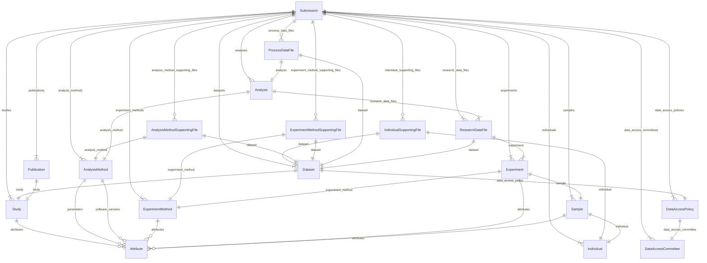
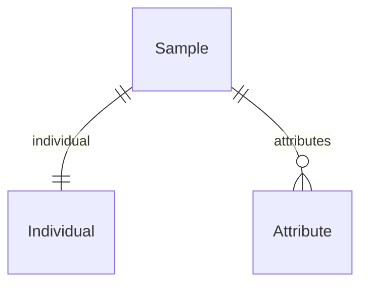
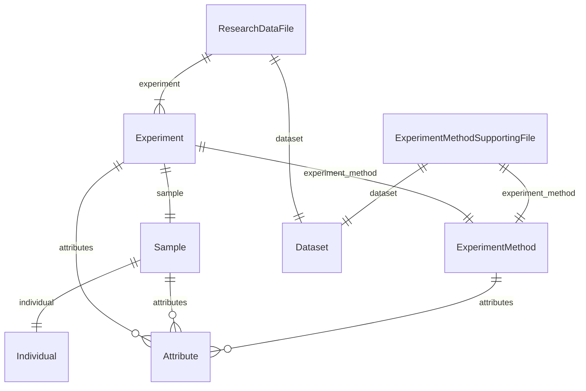
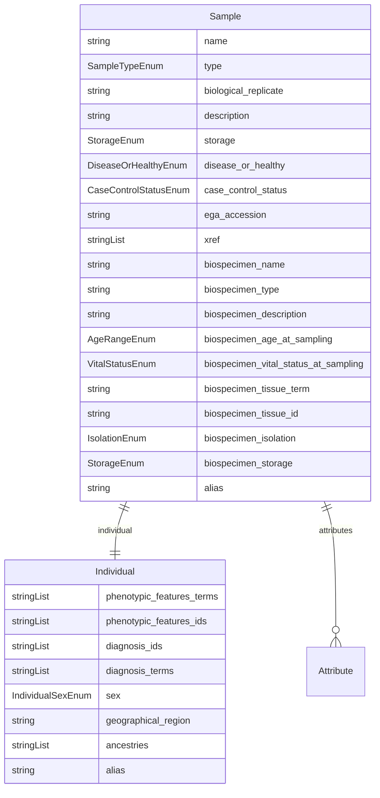
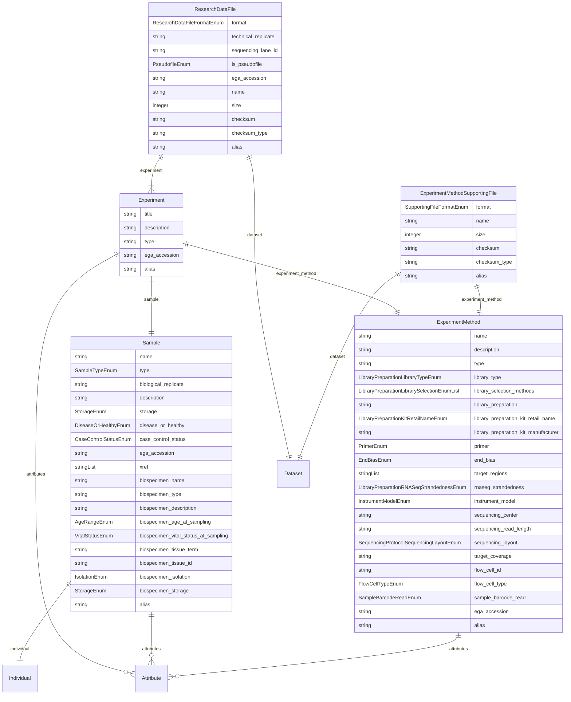

# Entity Relationship Diagrams

## Global Overview

An overview of the entire submission schema.  

## Sample & Individual

Focusses on the relation between Sample and Individual.  

## Experiment, Sample, & File

Focusses on the relation between Experiment, Sample, and File.  

## Sample & Individual (with attributes)

Focusses on the details of the relation between Sample, Biospecimen, and Individual.  

## Experiment, Sample, & File (with attributes)

Focusses on the relation between Experiment, Sample, and File.  

