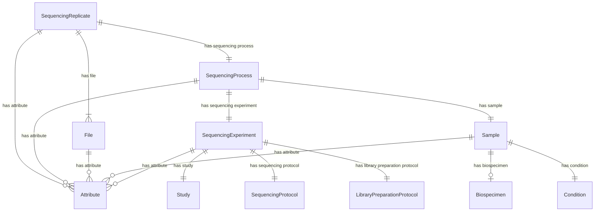
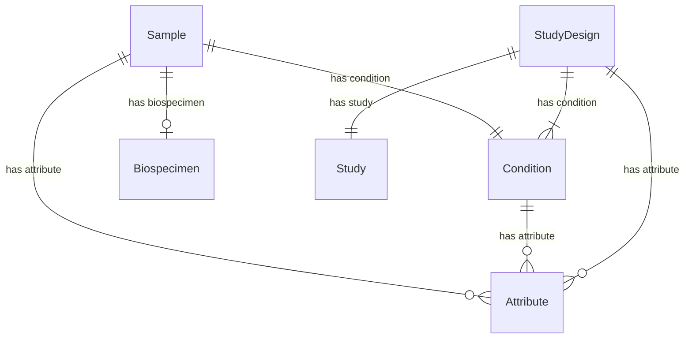
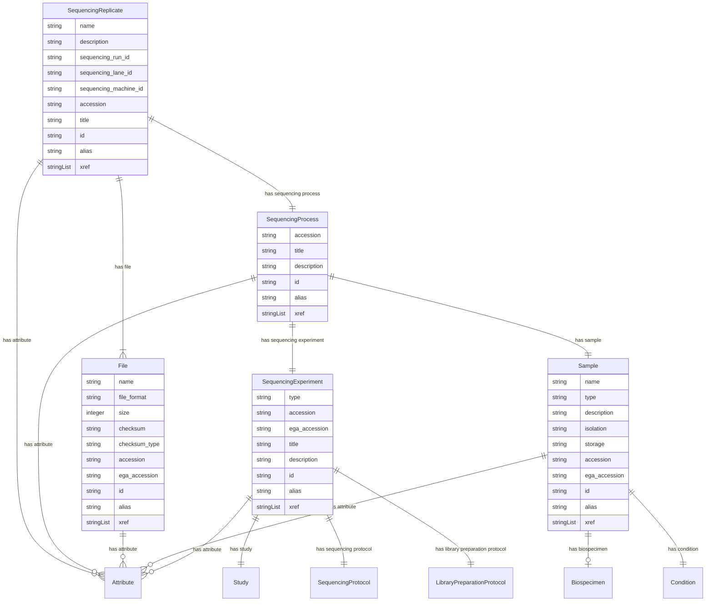
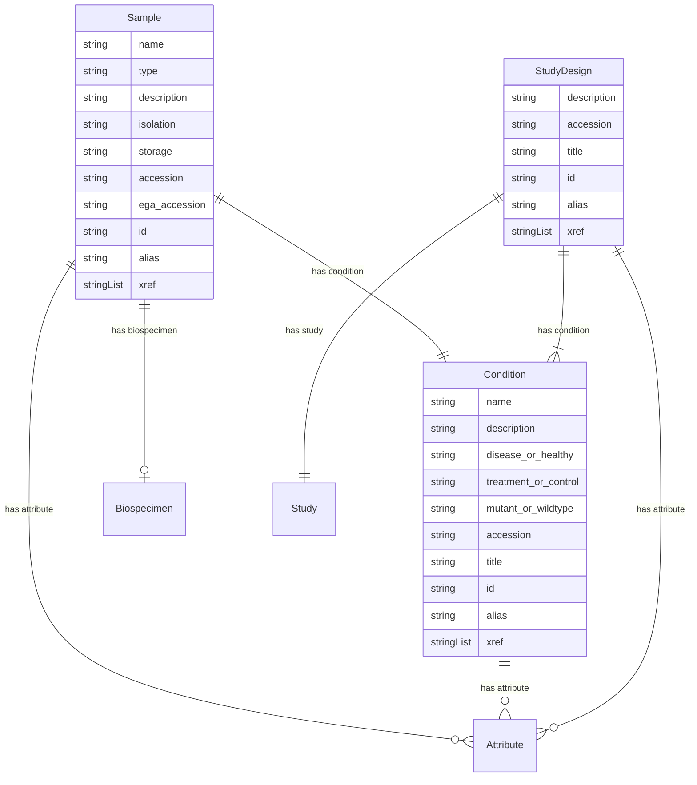

# Entity Relationship Diagrams

## Global Overview

An overview of the entire submission schema.  

```mermaid
erDiagram
Submission {

}
Publication {

}
Study {

}
Attribute {

}
Project {

}
Member {

}
DataAccessCommittee {

}
DataAccessPolicy {

}
DataUseModifier {

}
DataUsePermission {

}
Dataset {

}
File {

}
Analysis {

}
Protocol {

}
SequencingExperiment {

}
LibraryPreparationProtocol {

}
SequencingProtocol {

}
Individual {

}
PhenotypicFeature {

}
Disease {

}
Ancestry {

}
Biospecimen {

}
AnatomicalEntity {

}
Sample {

}
Condition {

}

Submission ||--|| Study : "has study"
Submission ||--|o Project : "has project"
Submission ||--}o Sample : "has sample"
Submission ||--}o Biospecimen : "has biospecimen"
Submission ||--}o Individual : "has individual"
Submission ||--}o SequencingExperiment : "has sequencing experiment"
Submission ||--}o Protocol : "has protocol"
Submission ||--}o Analysis : "has analysis"
Submission ||--}| File : "has file"
Submission ||--}| Dataset : "has dataset"
Submission ||--}| DataAccessPolicy : "has data access policy"
Submission ||--}| DataAccessCommittee : "has data access committee"
Submission ||--}| Member : "has member"
Submission ||--}o Publication : "has publication"
Publication ||--|| Study : "has study"
Study ||--|o Project : "has project"
Study ||--}o Attribute : "has attribute"
Project ||--}o Attribute : "has attribute"
DataAccessCommittee ||--|| Member : "main contact"
DataAccessCommittee ||--}o Member : "has member"
DataAccessCommittee ||--}o Attribute : "has attribute"
DataAccessPolicy ||--|| DataAccessCommittee : "has data access committee"
DataAccessPolicy ||--|| DataUsePermission : "has data use permission"
DataAccessPolicy ||--}o DataUseModifier : "has data use modifier"
DataAccessPolicy ||--}o Attribute : "has attribute"
Dataset ||--}| File : "has file"
Dataset ||--|o Publication : "has publication"
Dataset ||--|| DataAccessPolicy : "has data access policy"
Dataset ||--}o Attribute : "has attribute"
File ||--}o Attribute : "has attribute"
Analysis ||--}| File : "has input"
Analysis ||--|| Study : "has study"
Analysis ||--}| File : "has output"
Protocol ||--}| Attribute : "has attribute"
SequencingExperiment ||--|| Study : "has study"
SequencingExperiment ||--|| SequencingProtocol : "has sequencing protocol"
SequencingExperiment ||--|| LibraryPreparationProtocol : "has library preparation protocol"
SequencingExperiment ||--}o Attribute : "has attribute"
LibraryPreparationProtocol ||--}| Attribute : "has attribute"
SequencingProtocol ||--}| Attribute : "has attribute"
Individual ||--}o Ancestry : "has ancestry"
Individual ||--}o Individual : "has parent"
Individual ||--}o Individual : "has children"
Individual ||--}| Disease : "has disease"
Individual ||--}o PhenotypicFeature : "has phenotypic feature"
Individual ||--}o File : "has file"
Biospecimen ||--|| Individual : "has individual"
Biospecimen ||--}| AnatomicalEntity : "has anatomical entity"
Sample ||--|o Biospecimen : "has biospecimen"
Sample ||--|| Condition : "has condition"
Sample ||--}o Attribute : "has attribute"
Condition ||--}o Attribute : "has attribute"

```

## Sample, Biospecimen, & Individual

Focusses on the relation between Sample, Biospecimen, and Individual.  

## Experiment, Sample, & File

Focusses on the relation between Experiment, Sample, and File.  

## Study Design, Condition, & Sample

Focusses on the relation between Study Design, Condition, and Sample.  

## Sample, Biospecimen, & Individual (with attributes)

Focusses on the details of the relation between Sample, Biospecimen, and Individual.  

## Experiment, Sample, & File (with attributes)

Focusses on the relation between Experiment, Sample, and File.  

## Study Design, Condition, & Sample (with attributes)

Focusses on the relation between Study Design, Condition, and Sample.  

